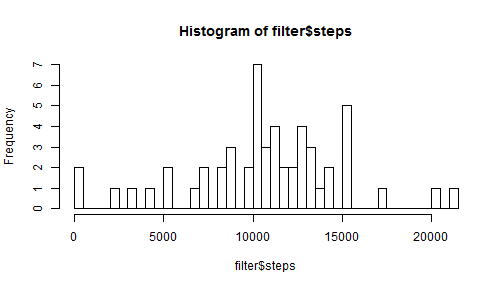
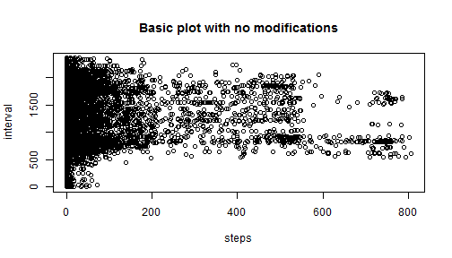
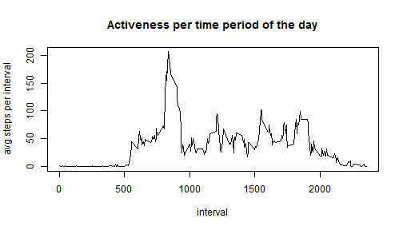
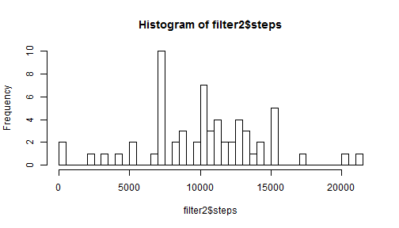
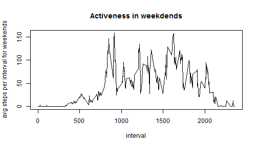
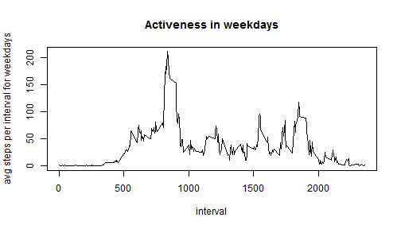

##Loading and preprocessing the data...

```r
library(utils)
unzip("activity.zip")
activity<-read.csv("activity.csv")
```

  
##What is mean total number of steps taken per day?

```r
library(stats)
filter <-aggregate(steps~date ,activity,FUN=sum) #creates a datatable with columns date    and total-steps-per-day
num_of_days <- length(filter$date)
hist(filter$steps,num_of_days) #length(filter$date) = 53 : the number of days
```

 

```r
mean_step <- mean(filter$steps)
mean_step
```

```
## [1] 10766.19
```

```r
median_step <- median(filter$steps)
median_step
```

```
## [1] 10765
```

##What is the average daily activity pattern?

```r
day_pattern <- activity[,c(1,3)]
plot(day_pattern,main="Basic plot with no modifications")
```

 

```r
day_pattern <- aggregate(steps ~ interval, day_pattern, mean)
plot(day_pattern,type = "l",ylab="avg steps per interval",main="Activeness per time period of the day")
```

 

```r
most_steps <- max(aggregate(steps ~ interval, day_pattern, mean)[,2],na.rm=T)
most_steps
```

```
## [1] 206.1698
```

```r
which(day_pattern$steps == most_steps, arr.ind = TRUE)  #gives the index
```

```
## [1] 104
```

```r
active_interval <- (day_pattern[104,1])      #since intervals start from 0
active_interval
```

```
## [1] 835
```


##Imputing missing values...

```r
filled_activity <- activity
Steps <- filled_activity$steps
NArows <- Steps[is.na(Steps)]
length(NArows)
```

```
## [1] 2304
```

```r
ndices_of_NAs <- which(is.na(Steps))
filled_activity[ndices_of_NAs,1] <-day_pattern[filled_activity[ndices_of_NAs,3]/5+1,2]  #On the right hand side activity[indices_of_NAs,3] gives the interval we want to use, but to get the row of that interval, we must apply /5+1
```


##Finding meand and median on the new data set...

```r
knitr::opts_chunk$set(cache=TRUE)       #it makes the variables accessible from other                 code chunks
filter2 <-aggregate(steps~date ,filled_activity,FUN=sum) #creates a datatable with   columns date    and total-steps-per-day
num_of_days2 <- length(filter2$date)
hist(filter2$steps,num_of_days2)      #length(filter$date) = 53 : the number of days
```

 

```r
mean(filter2$steps)
```

```
## [1] 10282.14
```

```r
median(filter2$steps)
```

```
## [1] 10395
```

```r
#day_pattern2 <- aggregate(steps ~ interval, filter2, mean)
#plot(day_pattern2,type = "l",ylab="avg steps per interval",main="Activeness per time period of the day")
```
  We can conclude that the new mean and median differs from the old mean 1.0766189 &times; 10<sup>4</sup> and old median 10765. By my calculations we get that the mean and the median should differ more that what we get before filling empty data. The reason for that is the negligence of outliers.
  
  
##Are there differences in activity patterns between weekdays and weekends?

```r
df = data.frame(date=filled_activity$date)
wkday <-c("Monday","Tuesday","Wednesday","Thursday","Friday")
df$day <- weekdays(as.Date(df$date))
filled_activity$weekday <-df$day %in% wkday  #1 if weekday, 0 otherwise
head(filled_activity)
```

```
##       steps       date interval weekday
## 1 1.7169811 2012-10-01        0    TRUE
## 2 0.3396226 2012-10-01        5    TRUE
## 3 0.1320755 2012-10-01       10    TRUE
## 4 0.1509434 2012-10-01       15    TRUE
## 5 0.0754717 2012-10-01       20    TRUE
## 6 2.0943396 2012-10-01       25    TRUE
```

```r
library(sqldf) 
weekend_pattern <- sqldf("select interval,avg(steps),weekday as avg_steps from filled_activity where weekday='0' group by interval,weekday")

plot(weekend_pattern[,-3],type = "l",ylab="avg steps per interval for weekends",main="Activeness in weekdends")
```

 

```r
weekday_pattern <- sqldf("select interval,avg(steps),weekday as avg_steps from filled_activity where weekday='1' group by interval,weekday")

plot(weekday_pattern[,-3],type = "l",ylab="avg steps per interval for weekdays",main="Activeness in weekdays")
```

 
  We can see from the two above graphs that people start later in the morning during weekends (interval 600-900) but in overall do more steps.
